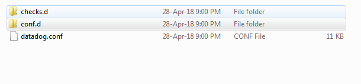

SNIA SwordfishTM Datadog Sample Integration Developer Guide

The purpose of this Developer Guide is to display the Datadog dashboards and
provide instruction on how to create them. Installation and user guides are also
available.

Contents
- [Introduction](#introduction)
- [SNIA Swordfish Sample Integration Dashboard for Datadog](#snia-swordfish-sample-integration-dashboard-for-datadog)
- [Brief Working Functionality](#brief-working-functionality)
- [Overview of Agents and Metrics](#overview-of-agents-and-metrics)
  * [Datadog Agent](#datadog-agent)
  * [Agent check](#agent-check)
  * [Metrics](#metrics)
- [Integration of Datadog dashboard](#integration-of-datadog-dashboard)
  * [Config files (YAML)](#config-files--yaml-)
  * [Checks (python) files](#checks--python--files)
- [Creation of Datadog Dashboard](#creation-of-datadog-dashboard)
  * [Time Board](#time-board)

Disclaimer
==========

The information contained in this publication is subject to change without
notice. The SNIA makes no warranty of any kind with regard to this
specification, including, but not limited to, the implied warranties of
merchantability and fitness for a particular purpose. The SNIA shall not be
liable for errors contained herein or for incidental or consequential damages in
connection with the furnishing, performance, or use.

Suggestions for revisions should be directed to http://www.snia.org/feedback/.

Copyright © 2016-2019 Storage Networking Industry Association.

Introduction
============

**SNIA Swordfish™ Specification**

The SNIA Swordfish™ specification helps to provide a unified approach for the
management of storage and servers in hyperscale and cloud infrastructure
environments, making it easier for IT administrators to integrate scalable
solutions into their data centers. SNIA Swordfish is an extension of the DMTF
Redfish specification, so the same easy-to-use RESTful interface is used, along
with JavaScript Object Notation (JSON) and Open Data Protocol (OData), to
seamlessly manage storage equipment and storage services in addition to servers.

SNIA Swordfish is designed to integrate with the technologies used in cloud data
center environments and can be used to accomplish a broad range of storage
management tasks from the simple to the advanced.

SNIA Swordfish has been designed around management use cases that focus on what
IT administrators need to do with storage equipment and storage services in a
data center. As a result, the API provides functionality that simplifies the way
storage can be allocated, monitored, and managed.
[Top](#section)

**SNIA Swordfish Datadog Sample Integration**

The Swordfish Datadog sample dashboard integration provides a dashboard for the
Datadog monitoring service that can connect to a Swordfish service (including
the Swordfish emulator), and provides an integration to the Datadog UI. It
provides connectivity to a Swordfish service and displays system capacity
information trending over time, configured capacity thresholds, and alert
information based on crossing those thresholds.

Datadog ([www.datadoghq.com](http://www.datadoghq.com)) is a monitoring service
for cloud-scale applications, providing monitoring of servers, databases, tools,
and services, through a SaaS based data analytics platform. Datadog enables
developers and operations teams see infrastructure, including cloud, servers,
apps, services, metrics, and more, all in one place. This includes real-time
interactive dashboards that can be customized to specific needs, full-text
search capabilities for metrics and events, sharing and discussion tools so
teams can collaborate using the insights they surface, targeted alerts for
critical issues, and API access to accommodate unique infrastructures.
[Top](#section)

SNIA Swordfish Sample Integration Dashboard for Datadog
=======================================================

There are two functional components that, together, make up the SNIA SwordfishTM
Datadog Sample Integration Dashboard functionality: the Datadog agent that
collects information from the Swordfish APIs on the storage systems, and the
Swordfish dashboard capability in the Datadog monitoring service.

Datadog Agent:

The Datadog Agent is a piece of software that runs on any host (or set of hosts
if high availability configuration is required)Its job is to faithfully collect
events and metrics and bring them to Datadog in order to present and manipulate
the monitoring and performance data within the dashboardThe Datadog Agent is
open source; view the source code on GitHub.

Swordfish Dashboard sample functionality:

Configurable Swordfish Dashboard views: Capacity data and threshold values for
different collections like Volumes, Storage pools and filesystems.

Data Collection: Using different custom metrics, Datadog will collect all the
required data and visualize it in to a Graph or Gauge
[Top](#section)

Brief Working Functionality
===========================

The following installation and configuration steps are needed in order to create
and use the Datadog dashboards.

1.  Install the Swordfish Emulator in local or host machines or vm.

2.  Install Datadog agent at each location to be monitored, to include vm,
    server, instances, and container running hosts.

3.  Configure Datadog to collect data from the Swordfish emulator where it’s
    running.

4.  Submit custom application metrics by modifying default metrics code.

5.  Open https://www.datadoghq.com in browser or user agent.

6.  Register and login to <https://www.datadoghq.com>.

7.  Create Datadog dashboards to show the required data in graphs. Instrument
    your own gauges, counters, timers and histograms.

Overview of Agents and Metrics
==============================

Datadog Agent
-------------

Datadog Agent <https://docs.datadoghq.com/agent> is software that runs on hosts,
which collects events and metrics for monitoring and performance of data. The
agent has three main parts: collector, DogStatsD and forwarder.

The Collector: Runs checks on the current machine for whatever integrations you
have and captures system metrics such as memory and CPU.

Dog-StatsD: A StatsD-compatible backend server you can send custom metrics to
from applications.

Forwarder: Retrieves data from both DogStatsD and the collector, and then queues
it up to be sent to Datadog.

Agent check
------------

Agent checks are used to collect metrics from custom application or systems.
It’s important to write integration for collecting all metrics available in an
application.

In Agent Check interface, all the custom checks will inherit from /checks/
directory and it requires a check () method that takes one argument and an
instance which is a dict having configuration of particular instance.

The check method is run once per instance defined in checks configuration.

Metrics
--------

Metrics allows creating Query metrics from any time period and post metrics data
which can be graphed on Datadog Dashboards.

There are three types of metrics Gauge, Rate and Count. The metrics type can be
changed. Metrics type is visible on metrics summary page.

There are many ways to send a metrics to Datadog, including with Datadog agent
directly, by using StatsD, or submit metrics directly to Datadog HTTP API.

Integration of Datadog dashboard
================================

After completing the installation of Datadog Agent, the /etc/dd-agent folder
will need modification in order to change the default configuration to create
and collect metrics.

There are two directories, one is “checks.d “and “conf.d”. The **conf.d**
directory contains **“.yaml“** files and the checks.d directory contains
**“python files”.** The agent checks and some logic are written in python and
rely on yaml file configuration.

Existing checks must be modified to create and collect metrics.

-   The name of the check file and the config file must match. For example, if
    the check file is named “**sample.py**“, then the config file must be named
    **sample.yaml.**

Config files (YAML)
-------------------

-   **Objective:** the developer can configure server integration by adding url
    and sub tags. Each check has a YAML configuration file that is placed in
    conf.d directory. The file name should match the name of checks module.

-   From the figure below, the .yaml file contains init_config and an
    ‘instances’ section.

>   The Init_config section allows configuration options available to run
>   checks.

>   The Instances Section is list of instances that runs against checks.

-   A developer can integrate Swordfish service by defining a URL and some
    information regarding the service.

-   A developer can then add tags and sub-tags of the resource which provides
    easy access to all the data in a particular server.

Checks (python) files
---------------------

-   **Objective:** The main part of checks is making a request to a URL. Once
    the request passes, you may then write custom metrics for service URL which
    is placed in .yaml file.

-   All the custom checks inherited from AgentCheck and it will take check () to
    take arguments. Each check instance has its own instance of class.

-   The check method runs once per instance.

-   Checks will make a request to the service URL and response time.

-   Developer can send events, gauges and service checks in a check.

-   From the below example is a method of sending metrics in a check

    -   E.g., Self.gauge( )

-   The above method can take arguments like value, tag, hostname and metrics.

-   All the custom checks are not able to import modules by default.

-   Once the checks are placed in checks.d folder, they can be verified by
    restarting the agent.

    -   E.g., sudo service datadog-agent restart . (In Ubuntu operating system.)

Creation of Datadog Dashboard
=============================

To create a dashboard, go to ‘Dashboards’ tab via the left panel.

Select New dashboard button at top right.

The following window will open to allow selection any of the dashboard type. The
developer can assigned the new dashboard a name and select a desired dashboard
type.

A new Dashboard window will open as shown in below figure. The Developer can
select different types of components for visualization.

Time Board
----------

In Timeboard, the developer selects different types of graphs by simply dragging
and dropping time series widgets onto the dashboard. Timeboards have very
specific structure, which can subsequently be added to grid of graphs. If
developers want to show more flexibility with placement of graphs, screenboards
can be used.

Line graph displays a line for each graph of data. By default, all hosts that
report metrics are combined into single line. Developers can choose one of the
metrics collected by organization here, as long as those metrics have seen new
data in last 24 hrs.

Next dropdown will select the subset of hosts from which to collect data. Refer
back to the tags which were previously created in the Config files. Here you can
choose that same tag and see metrics only from the hosts running a database.
Next you can choose whether you want to show avg, max, min and sum of values in
a metrics.

If you click the advanced link to the right, you can combine metrics using
variety of mathematical functions.

After all the above changes are complete, click on save and create next gauge if
desired. Note that there are few visualizations available in ScreenBoards that
are not in Timeboards.

**ScreenBoard**

To create a ScreenBoard, first create a new dashboard and then choose
Screenboard. In Screenboard you can place and size the graphs anywhere you like
and you can control the period shown on per graph basis. There are few
visualizations available only in screenboard.

If the developer tries to select any graph, a window will open as shown in below
figure. The developer should edit the graph data and select visualization type
to create a gauge.

Samples of the different types of graphs in a dashboard are shown in the
following figure. If a Developer wants to modify the data , you must click on
the ‘Edit Board’ button.

The following Dashboard shows the Consumed bytes and Allocated bytes data.
Select the graph from the top menu by editing the menu.

The graph editor mode is shown in figure below. The developer can use the
options to select visualization and add metrics data.

Additional information on the SNIA Swordfish specification and use is available
at https://www.snia.org/swordfish and <https://github.com/SNIA>.
