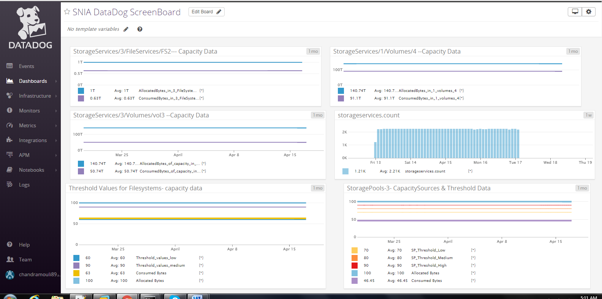

SNIA SwordfishTM Datadog Sample Integration Installation Guide
==========
The purpose of this Installation Guide is to illustrate the installation process
which will enable Datadog integration to a Swordfish service, and display of
system capacity information and available capacity thresholds. Developer and
user guides are also available.

Contents
========
- [Disclaimer](#disclaimer)
- [Introduction](#introduction)
- [SNIA Swordfish Sample Integration Dashboard for Datadog](#snia-swordfish-sample-integration-dashboard-for-datadog)
    + [Datadog Agent](#datadog-agent)
    + [Swordfish Dashboard Functionality](#swordfish-dashboard-functionality)
- [Brief Working Overview](#brief-working-overview)
- [Steps to Install and Run the Datadog Agent](#steps-to-install-and-run-the-datadog-agent)
- [Steps To Configure Sample Dashboard](#steps-to-configure-sample-dashboard)

Disclaimer
==========

The information contained in this publication is subject to change without
notice. The SNIA makes no warranty of any kind with regard to this
specification, including, but not limited to, the implied warranties of
merchantability and fitness for a particular purpose. The SNIA shall not be
liable for errors contained herein or for incidental or consequential damages in
connection with the furnishing, performance, or use.

Suggestions for revisions should be directed to http://www.snia.org/feedback/.

Copyright © 2016-2019 Storage Networking Industry Association.

[Top](#section)

Introduction
==========

**SNIA Swordfish™ Specification**

The SNIA Swordfish™ specification helps to provide a unified approach for the
management of storage and servers in hyperscale and cloud infrastructure
environments, making it easier for IT administrators to integrate scalable
solutions into their data centers. SNIA Swordfish is an extension of the DMTF
Redfish specification, so the same easy-to-use RESTful interface is used, along
with JavaScript Object Notation (JSON) and Open Data Protocol (OData), to
seamlessly manage storage equipment and storage services in addition to servers.

SNIA Swordfish is designed to integrate with the technologies used in cloud data
center environments and can be used to accomplish a broad range of storage
management tasks from the simple to the advanced.

SNIA Swordfish has been designed around management use cases that focus on what
IT administrators need to do with storage equipment and storage services in a
data center. As a result, the API provides functionality that simplifies the way
storage can be allocated, monitored, and managed.

**SNIA Swordfish™ Datadog Sample Integration**

The Swordfish Datadog sample dashboard integration provides a dashboard for the
Datadog monitoring service that can connect to a Swordfish service (including
the Swordfish emulator), and provides an integration to the Datadog UI. It
provides connectivity to a Swordfish service and displays system capacity
information trending over time, configured capacity thresholds, and alert
information based on crossing those thresholds.

Datadog ([www.datadoghq.com](http://www.datadoghq.com)) is a monitoring service
for cloud-scale applications, providing monitoring of servers, databases, tools,
and services, through a SaaS based data analytics platform. Datadog enables
developers and operations teams see infrastructure, including cloud, servers,
apps, services, metrics, and more, all in one place. This includes real-time
interactive dashboards that can be customized to specific needs, full-text
search capabilities for metrics and events, sharing and discussion tools so
teams can collaborate using the insights they surface, targeted alerts for
critical issues, and API access to accommodate unique infrastructures.

[Top](#section)

SNIA Swordfish Sample Integration Dashboard for Datadog
==========
There are two functional components that, together, make up the SNIA SwordfishTM
Datadog Sample Integration Dashboard functionality: the Datadog agent that
collects information from the Swordfish APIs on the storage systems, and the
Swordfish dashboard capability in the Datadog monitoring service.

### Datadog Agent

   The Datadog Agent is a piece of software that runs on any host (or set of
   hosts if high availability configuration is required). Its job is to
   faithfully collect events and metrics and bring them to Datadog in order to
   present and manipulate the monitoring and performance data within the
   dashboard. The Datadog Agent is open source; view the source code on GitHub
   [(github.com/DataDog](https://github.com/DataDog)).

### Swordfish Dashboard Functionality
    
   The Swordfish Dashboard offers views of capacity data and threshold values for different
   collections including Volumes, Storage pools and filesystems.

   The Data Collection uses various custom metrics. Datadog will collect all
   the required values and visualize the data it in to a Graph or Gauge.

[Top](#section)

Brief Working Overview
==========
The following steps provide an overview of the actions necessary in order to utilize the Datadog integration.

1.  Install the Swordfish Emulator in local or host machines or virtual machines (vm).

2.  Install Datadog agent in each of the environment locations including vm,
    server, instances, container and running hosts.

3.  Configure Datadog to collect data from the Swordfish emulator where it is
    running.

4.  Submit custom application metrics by writing code.

5.  Open https://www.datadoghq.com in browser or user agent.

6.  Register and login to <https://www.datadoghq.com>.

7.  Create Datadog dashboards to show the required data in graphs, customized gauges, 
    counters, timers and histograms.

[Top](#section)

Steps to Install and Run the Datadog Agent
==========

1. Before installing Datadog, the Swordfish Emulator should be running on local
   machines or Server machines to be the source of raw data to the Datadog
   dashboard.
    
   Refer to the Swordfish Emulator Installation documentation to find steps to
   install the swordfish emulator in windows or linux systems. Additional steps to
   configure local machines are described in developer documentation (Python
   and SNIA emulator need to be installed.)

2.  After installing the Swordfish Emulator on the local network, the next step is to install Datadog.

3.  Login to the Datadog web site ( <https://app.datadoghq.com/> )

4.  Create API keys and Application keys to be used in local services. 
    (<https://app.datadoghq.com/account/settings#api/>) 
    Note: A Datadog account required for this process.

5.  Install Datadog on a local machine.

    Recommended Operating System: Ubuntu 16.04 (Swordfish tested configuration)
    Additional Supported Operating Systems: Windows 7, 8 and 10

6. Installation Steps (For recommended operating system Ubuntu Linux configuration.)

   Run the below commands to install Datadog in local machine.

     - sudo apt-get update

     - sudo apt-get install apt-transport-https

   Set Datadog deb repo on local and import Datadog API key.
   
     - sudo sh -c "echo 'deb https://apt.datadoghq.com/ stable 6' \>
      /etc/apt/sources.list.d/datadog.list"
    
     - sudo apt-key adv --recv-keys --keyserver hkp://keyserver.ubuntu.com:80382E94DE

   Use local apt repo and install the agent.

     - sudo apt-get update

     - sudo apt-get install datadog-agent
    
   Place created API key and copy it to configuration.

     - sudo sh -c "sed 's/api_key:.\*/api_key: a7bf617d0e83ce090b870bc3853019c3/'
      /etc/datadog-agent/datadog.yaml.example \> /etc/datadog-agent/datadog.yaml"
    
   Start Agent

     - sudo systemctl restart datadog-agent.service

7. Start the Datadog agent

    Start the Agent as a service:

   -  sudo /etc/init.d/datadog-agent start

   Restart the agent running as a service:

  -   sudo /etc/init.d/datadog-agent restart

   View the status page of the running agent:

  -   sudo /etc/init.d/datadog-agent info

[Top](#section)

Steps To Configure Sample Dashboard
==========
   A new dashboard can be created from left menu of Datadog page.

   -   Click on Dashboard -\> New Dashboard

   After creating the dashboard, graphs can be selected by dragging widgets onto
   the dashboard to visualize the data in a range of customizable views.

[Top](#section)

The dashboard offers user defined customization through selections for graph, display and visualization preferences, metrics and events, and titles options. Sample Datadog graph options can be viewed on the Datadog site at https://docs.datadoghq.com/graphing/.

[Top](#section)

Additional information on the SNIA Swordfish specification and use is available
at https://www.snia.org/swordfish and <https://github.com/SNIA>.
