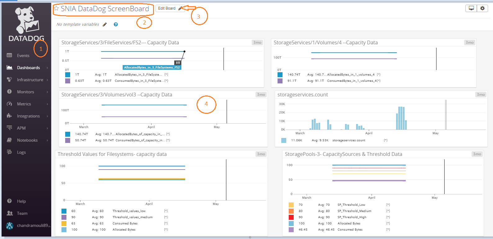
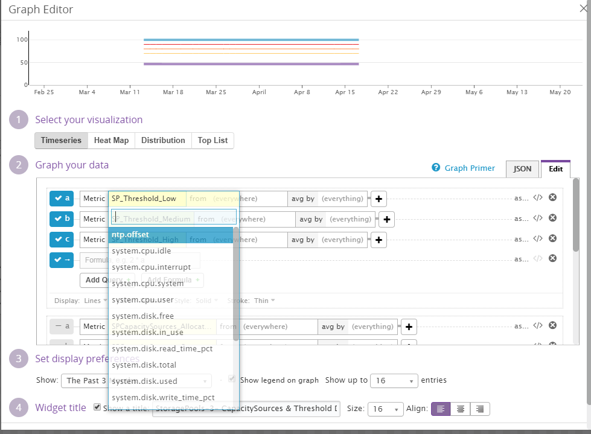
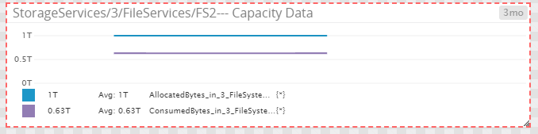
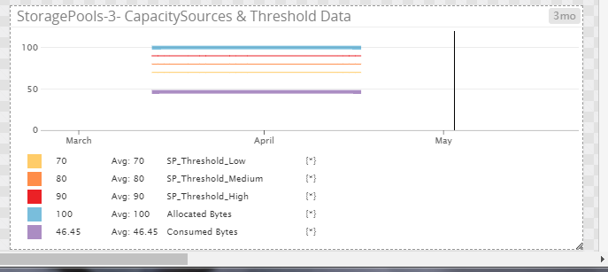

SNIA SwordfishTM Datadog Sample Integration User Guide
======================================================

The purpose of this User Guide is to illustrate the Datadog dashboard
integration usage and functionality. Developer and installation guides are also
available.

Contents
========
- [Disclaimer](#disclaimer)
- [Introduction](#introduction)
- [SNIA Swordfish Sample Integration Dashboard for Datadog](#snia-swordfish-sample-integration-dashboard-for-datadog)
- [Overview of Key Features](#overview-of-key-features)
- [Dashboard Screens Examples](#dashboard-screens-examples)

Disclaimer
==========

The information contained in this publication is subject to change without
notice. The SNIA makes no warranty of any kind with regard to this
specification, including, but not limited to, the implied warranties of
merchantability and fitness for a particular purpose. The SNIA shall not be
liable for errors contained herein or for incidental or consequential damages in
connection with the furnishing, performance, or use.

Suggestions for revisions should be directed to http://www.snia.org/feedback/.

Copyright © 2016-2019 Storage Networking Industry Association.

[Top](#section)

Introduction
================

**SNIA Swordfish™ Specification**

The SNIA Swordfish™ specification helps to provide a unified approach for the
management of storage and servers in hyperscale and cloud infrastructure
environments, making it easier for IT administrators to integrate scalable
solutions into their data centers. SNIA Swordfish is an extension of the DMTF
Redfish specification, so the same easy-to-use RESTful interface is used, along
with JavaScript Object Notation (JSON) and Open Data Protocol (OData), to
seamlessly manage storage equipment and storage services in addition to servers.

SNIA Swordfish is designed to integrate with the technologies used in cloud data
center environments and can be used to accomplish a broad range of storage
management tasks from the simple to the advanced.

SNIA Swordfish has been designed around management use cases that focus on what
IT administrators need to do with storage equipment and storage services in a
data center. As a result, the API provides functionality that simplifies the way
storage can be allocated, monitored, and managed.

**SNIA Swordfish™ Datadog Sample Integration**

The Swordfish Datadog Sample Integration Dashboard provides a dashboard for the
Datadog monitoring service that can connect to a Swordfish service (including
the Swordfish emulator), and provides an integration to the Datadog user
interface. It provides connectivity to a Swordfish service and displays system
capacity information trending over time, configured capacity thresholds, and
alert information based on crossing those thresholds.

Datadog ([www.datadoghq.com](http://www.datadoghq.com)) is a monitoring service
for cloud-scale applications, providing monitoring of servers, databases, tools,
and services, through a SaaS based data analytics platform. Datadog enables
developers and operations teams see infrastructure, including cloud, servers,
apps, services, metrics, and more, all in one place. This includes real-time
interactive dashboards that can be customized to specific needs, full-text
search capabilities for metrics and events, sharing and discussion tools so
teams can collaborate using the insights they surface, targeted alerts for
critical issues, and API access to accommodate unique infrastructures.

[Top](#section)

SNIA Swordfish Sample Integration Dashboard for Datadog
=======================================================

There are two functional components that, together, make up the SNIA SwordfishTM
Datadog Sample Integration Dashboard functionality:

1.  **Datadog Agent** - collects information from the Swordfish APIs on the
    storage systems. The Datadog Agent is a piece of software that runs on any
    host (or set of hosts if high availability configuration is required). Its
    job is to faithfully collect events and metrics and bring them to Datadog in
    order to present and manipulate the monitoring and performance data within
    the dashboard. The Datadog Agent is open source; view the source code on
    GitHub [(github.com/DataDog](https://github.com/DataDog))

2.  **Swordfish dashboard** – provides views of capacity data and threshold
    values for different collections including Volumes, Storage pools and file
    systems. Data is collected using different custom metrics, Datadog will
    collect all the required data and visualize it in to a Graph or Gauge

[Top](#section)

Overview of Key Features
========================

The key features of the integration include events, dashboards and metrics.
These features allow for data to be displayed and viewed in multiple
configurable ways to accommodate user needs.

**Events Features**

-   The Event Stream is based on conventions similar a weblog (blog).

-   The blog format is functional for distributed team discussions and
    information posts.

-   Each event in the stream can be commented on by multiple users.

-   Event stream content can be filtered and viewed by user, source, tag, host,
    status, priority, and incident.

**Dashboards Features**

-   Dashboards contain graphs with real-time performance metrics which allow the
user to perform the following:

-   Synchronous mousing occurs when the cursor moves across all graphs in a
screenboard.

-   Vertical bars are displayed events in the context of the metric.

-   Click & drag on a graph to zoom-in on a particular time-frame.

-   Hovering over the graph the event stream moves with you.

-   Data can be displayed by zone, host, or total usage.

**Metrics**

Custom metrics refer to any metric sent using statsd, DogStatsD, or through
extensions made to the Datadog Agent. Some integrations can potentially produce
an unlimited number of metrics that can also count as custom, further details on
which standard integrations emit custom metrics.

[Top](#section)

**Dashboard Features**

The Datadog Dashboard appears at left menu of the Datadog home page as shown in
figure below. No installations are required for Datadog dashboard. Users can
select a Screenboard or Timeboard the type of dashboard screen.

The Main Dashboard contains the following features:

1.  Menu-Bar

2.  Dashboard Title

3.  Edit Button of Dashboard

4.  Graph view

[Top](#section)

**Graph Editor Features**

Using the graph editor, the user can edit how the information is displayed and
change the data and visualization. The graphing editor has Share, JSON, and Edit
tabs

-   Share: Allows you to embed the graph on any external web page. The share tab
    is available only on the Timeboards dashboard.

-   JSON: The more flexible editor, and it requires knowledge of the graph
    definition language to make use of it.

-   Edit: Default tab that allows you to use a GUI to select the graphing
    options.

[Top](#section)

Dashboard Screens Examples
==========================

Below figure shows capacity data in FileServices.

**Capacitydata with Threshold values.**

Monitoring on periodic a schedule will enable display consistency of capacity
and storage services data.

[Top](#section)

Additional information on the SNIA Swordfish specification and use is available
at https://www.snia.org/swordfish and <https://github.com/SNIA>.
